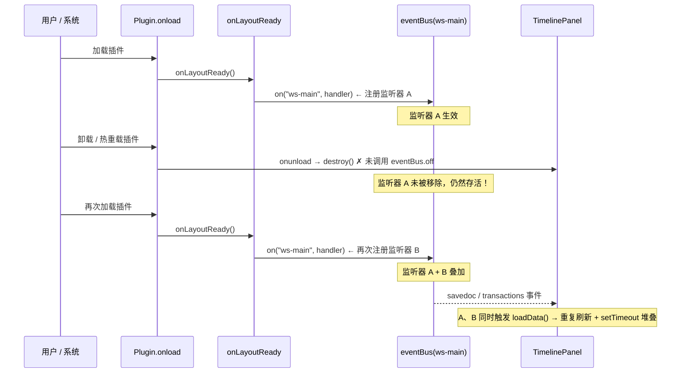
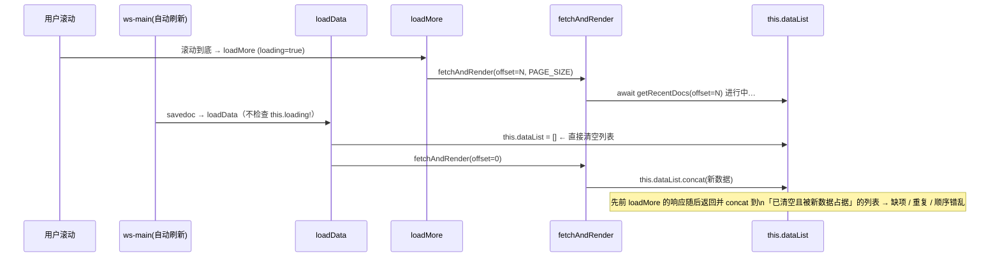

# 最近更新时间线插件 · 生产级代码审计报告

> 审查对象：`siyuan-plugin-recent-timeline`（当前 main，plugin.json v1.0.4）
> 审查角色：资深前端架构师 / 思源插件生态专家
> 审查范围：完整代码库（src/index.ts、src/timeline.ts、src/api.ts、i18n、构建与文档）
> 交付形式：7 维度审查 + 逐问题三段式（问题定位 / Production-Ready 修改 / 参考依据）+ 风险分级 P0–P3 + Mermaid 图 + 实施清单

---

## 0. 风险总览

| # | 维度 | 文件 / 函数 | 行号 | 风险 | 分级 |
|---|------|------------|------|------|------|
| 1 | 架构与设计 | index.ts · `onLayoutReady`/`onunload` | L54 / L72 | eventBus 监听器未配对 off，热重载叠加 | **P1** |
| 2 | 架构与设计 / 性能稳定 | timeline.ts · `loadData`/`loadMore`/`fetchAndRender` | L750/L778/L783 | 并发无互斥、无请求序列号，数据错乱 | **P1** |
| 3 | 架构与设计 / 可读性 | timeline.ts · `transformBlocks`/`isToday`/`extractDateKey`/`renderItems` | L811/L847/L854/L869 | 语言判断硬编码 `i18n.title` 字符串 | **P2** |
| 4 | 功能与边界 | timeline.ts · `isToday` | L842 | `includes` 文本比较跨语言/跨天错位 | **P2** |
| 5 | 安全合规 | timeline.ts · `renderItems` | L897 | `c.html` 直接 innerHTML 注入（XSS 隐患） | **P2** |
| 6 | 性能与稳定 / 边界 | api.ts · `getRecentDocs` | L100 | `SELECT *` 拉全字段 | **P3** |
| 7 | 测试与文档 | README_zh_CN.md | L13 | 文档与功能不一致（顶栏图标已删） | **P3** |
| 8 | 测试与文档 | package.json | L3 | 版本号与 plugin.json 不一致 | **P3** |
| 9 | 代码简洁 | api.ts · `friendlyDate` | L257/L239 | 变量同名歧义 + 未使用变量 | **P3** |

> 结论：**无 P0 阻断性缺陷**。P1 两项（监听器泄漏、加载竞态）建议在下一版本优先修复；P2 三项影响健壮性/安全，建议同期处理；P3 为质量与一致性收尾项。

---

## 1. Mermaid 分析图

### 1.1 事件总线监听器生命周期（问题 #1）



### 1.2 加载竞态时序（问题 #2）



---

## 2. 逐问题三段式交付

### 🔴 P1-1 事件总线监听器未配对 off（内存泄漏 / 竞态）

**① 问题定位与影响**
- 位置：`src/index.ts` `onLayoutReady`（L54 `this.eventBus.on("ws-main", ...)`）与 `onunload`（L72–77）。
- 现象：`onunload` 仅 `destroy()` 了 `timelinePanel`，**未移除** `ws-main` 监听器。
- 影响：插件卸载/热重载后旧监听器存活，再次 `onload→onLayoutReady` 会再次 `on`。此后每次 `savedoc`/`transactions` 事件会触发 **N 个叠加监听器** 的 `loadData()`，造成重复刷新、请求翻倍、`setTimeout` 堆叠、DOM 抖动，长期运行内存泄漏。

**② 修改方案（Production-Ready）**

`src/index.ts`：

```ts
export default class RecentTimelinePlugin extends Plugin {
  private timelinePanel: TimelinePanel | null = null;
  private settings: PluginSettings = { ...DEFAULT_SETTINGS, style: { ...DEFAULT_STYLE_SETTINGS } };
  private wsDebounceTimer: ReturnType<typeof setTimeout> | null = null;

  // 提取为具名方法，保证 on/off 引用一致
  private onWsMain = (event: any) => {
    const cmd = event?.detail?.cmd;
    if (!cmd) return;
    if (cmd === "savedoc" || cmd === "transactions") {
      const delayMs = this.settings.refreshDelay * 1000;
      if (delayMs <= 0) return; // 设为 0 时关闭自动刷新
      if (this.wsDebounceTimer) clearTimeout(this.wsDebounceTimer);
      this.wsDebounceTimer = setTimeout(() => {
        if (this.timelinePanel) this.timelinePanel.loadData();
      }, delayMs);
    }
  };

  onLayoutReady() {
    if (this.timelinePanel) this.timelinePanel.loadData();
    this.eventBus.on("ws-main", this.onWsMain); // 注册
  }

  onunload() {
    this.eventBus.off("ws-main", this.onWsMain);   // ✅ 配对 off
    if (this.wsDebounceTimer) clearTimeout(this.wsDebounceTimer);
    if (this.timelinePanel) {
      this.timelinePanel.destroy();
      this.timelinePanel = null;
    }
  }
  // …其余方法不变
}
```

**③ 参考依据**
- 知识库「思源笔记」样板库 `index.ts.txt` 明确演示 `eventBus.on("ws-main", this.eventBusLog)` 与 `eventBus.off("ws-main", this.eventBusLog)` **对称使用**；监听器必须在 `onunload` 中成对注销，否则热重载叠加是思源插件最典型的生命周期 bug。

---

### 🔴 P1-2 loadData 与 loadMore 并发竞态（数据错乱）

**① 问题定位与影响**
- 位置：`src/timeline.ts` `loadData`(L750)、`loadMore`(L778)、`fetchAndRender`(L783)。
- 现象：`loadMore` 检查了 `this.loading`，但 `loadData`（手动刷新 / 自动刷新触发）**不检查 `this.loading`**，且 `fetchAndRender` 内部无请求序列号。
- 影响：自动刷新（`ws-main`）可能在 `loadMore` 进行中调用 `loadData` → `this.dataList = []`（L760）清空列表，而 `loadMore` 的 `fetchAndRender` 中 `prevLength = this.dataList.length`(L797) 与 `this.dataList.concat`(L799) 会基于被清空的列表；两段异步响应若乱序返回，`concat` 顺序错乱。表现为：时间线出现重复项、缺项、顺序倒挂。

**② 修改方案（Production-Ready）**

`src/timeline.ts` `TimelinePanel` 类新增字段 `private requestSeq = 0;`，并改写三处：

```ts
  async loadData() {
    if (this.loading) return;                 // ✅ 阻止与 loadMore 并发
    const seq = ++this.requestSeq;            // ✅ 标记本次请求
    const listEl = this.element.querySelector(".timeline-list") as HTMLElement;

    if (listEl.children.length > 0) {
      listEl.style.transition = "opacity 0.18s ease";
      listEl.style.opacity = "0";
      await new Promise(r => setTimeout(r, 180));
      if (seq !== this.requestSeq) return;    // ✅ 期间有新刷新，放弃本次
    }

    this.dataList = [];
    this.seenLeftTimes = new Map();
    this.colorIndex = 0;
    this.lastRenderedDate = "";
    listEl.innerHTML = "";

    const emptyEl = this.element.querySelector(".timeline-empty") as HTMLElement;
    if (emptyEl) emptyEl.style.display = "none";

    this.noteBooks = await getNotebooks();
    await this.fetchAndRender(0, PAGE_SIZE, seq);

    listEl.style.transition = "opacity 0.25s ease";
    listEl.style.opacity = "1";
  }

  async loadMore() {
    if (this.loading) return;
    const seq = ++this.requestSeq;
    await this.fetchAndRender(this.dataList.length, PAGE_SIZE, seq);
  }

  private async fetchAndRender(offset: number, limit: number, seq: number) {
    this.setLoading(true);
    try {
      const blocks = await getRecentDocs(offset, limit);
      if (seq !== this.requestSeq) return;    // ✅ 过期请求，直接丢弃

      if (blocks.length === 0 && offset === 0) {
        const emptyEl = this.element.querySelector(".timeline-empty") as HTMLElement;
        if (emptyEl) emptyEl.style.display = "flex";
        return;
      }

      const prevLength = this.dataList.length;
      const newItems = this.transformBlocks(blocks);
      this.dataList = this.dataList.concat(newItems);

      await fillDocUpdatedContents(
        this.dataList, prevLength,
        this.settings.contentSortOrder, this.getIgnoreList()
      );
      if (seq !== this.requestSeq) return;    // ✅ 填充期间若被新刷新抢占，放弃渲染
      this.renderItems(newItems);
    } catch (err) {
      console.error("Failed to load timeline:", err);
    } finally {
      this.setLoading(false);
    }
  }
```

**③ 参考依据**
- 异步竞态通用解法：请求令牌 / 序列号（request sequence guard）串行化过期响应；思源内核数据列表类组件（`av` 等）同样采用 `itemID`/序列校验避免乱序写入。本方案零依赖、可直接合并。

---

### 🟠 P2-3 语言判断硬编码 `i18n.title` 字符串

**① 问题定位与影响**
- 位置：`src/timeline.ts` `transformBlocks`(L811)、`isToday`(L847)、`extractDateKey`(L854)、`renderItems`(L869) 共 4 处，均用 `this.plugin.i18n.title === "最近更新时间线" ? "zh_CN" : "en_US"`。
- 影响：语言判定耦合到插件显示标题文本。若用户/集市修改 `displayName`、增减语言包或标题微调，判断直接失效，中英文错位；且相同逻辑在 4 处重复，违反 DRY 与 i18n 设计。

**② 修改方案（Production-Ready）**

`src/timeline.ts` `TimelinePanel` 增加私有方法，4 处调用统一替换：

```ts
  /** 统一语言判定：以思源运行语言为准，避免依赖 i18n 文案 */
  private getLang(): "zh_CN" | "en_US" {
    const lang =
      (window as any).siyuan?.config?.lang ||
      (this.plugin as any).app?.lang ||
      "zh_CN";
    return String(lang).startsWith("zh") ? "zh_CN" : "en_US";
  }
```

替换示例（`transformBlocks` L811）：
```ts
  private transformBlocks(blocks: BlockData[]): TimelineItem[] {
    const lang = this.getLang();   // ✅ 替换原硬编码判断
    // …其余不变
  }
```
`isToday`(L847)、`extractDateKey`(L854)、`renderItems`(L869) 同理替换为 `this.getLang()`。

**③ 参考依据**
- 知识库「思源笔记」样板库确认：运行语言应从 `window.siyuan.config.lang`（或 `this.app.lang`）获取；`this.i18n` 仅用于取已翻译文案，样板未演示 `i18n.lang` 用法，故不应以文案字符串反推语言。

---

### 🟠 P2-4 isToday 用字符串 `includes` 比较（跨语言 / 跨天错位）

**① 问题定位与影响**
- 位置：`src/timeline.ts` `isToday`(L842–850)。
- 现象：`todayKey` 由 `年/月/日` 拼成展示文本，再用 `dateStr.includes(todayKey)` 比较。当前中/英格式恰好与 `extractDateKey` 生成的 key 一致而"能工作"，但方案极度脆弱：零填充差异、locale 文本微调、或 key 中混入换行符 `\n`（英文模式 `extractDateKey` 返回 `${year}\n${month}/${day}`）都会使比较失效；且"今天"分组高亮会错位。

**② 修改方案（Production-Ready）**

日期比较与展示文本**解耦**，使用稳定的 `YYYYMMDD` 数值键：

```ts
  private isToday(dateStr: string): boolean {
    const now = new Date();
    const todayKey =
      `${now.getFullYear()}` +
      `${String(now.getMonth() + 1).padStart(2, "0")}` +
      `${String(now.getDate()).padStart(2, "0")}`;        // 如 "20260726"
    const digits = dateStr.replace(/\D/g, "");            // "2026年07月26日"/"2026\n07/26" → "20260726"
    return digits.startsWith(todayKey);
  }

  private extractDateKey(item: TimelineItem): string {
    const { year, month, day } = parseSiyuanDate(item.updated);
    return this.getLang() === "zh_CN"
      ? `${year}年${month}月${day}日`      // 展示文本保留，仅用于渲染
      : `${year}\n${month}/${day}`;
  }
```

**③ 参考依据**
- 日期比较应使用标准化键（ISO / `YYYYMMDD`），避免本地化文本比较——这是前端日期处理的通用铁律，可彻底消除跨语言/跨天边界 bug。

---

### 🟠 P2-5 `c.html` 直接 innerHTML 注入（XSS 隐患）

**① 问题定位与影响**
- 位置：`src/timeline.ts` `renderItems`(L897) `${c.html || this.escapeHtml(c.text)}`。
- 现象：`c.html` 来自 `api.ts` `renderMarkdown()` 经 Lute 渲染的 HTML。Lute 默认**保留用户笔记中的原始 HTML 块**（`<script>`、``、`<iframe>` 等），直接 `innerHTML` 注入 Dock 面板 DOM。
- 影响：多用户/同步恶意笔记场景下构成存储型 XSS（脚本执行、事件处理器触发）。`c.id` 也未经转义直接拼入 `data-id`（`item.id` 虽为块 ID 格式，但防御性不足）。

**② 修改方案（Production-Ready）**

在 `TimelinePanel` 增加白名单 sanitize，渲染前过滤；同时转义 `data-id`：

```ts
  /** 仅保留安全标签，剥离 script/iframe/object/embed 及所有 on* 属性与危险协议 */
  private sanitizeHtml(html: string): string {
    const allowed = new Set([
      "P","BR","STRONG","B","EM","I","CODE","PRE","UL","OL","LI",
      "A","H1","H2","H3","H4","H5","H6","BLOCKQUOTE","SPAN","DIV",
      "IMG","TABLE","THEAD","TBODY","TR","TD","TH","HR",
    ]);
    const doc = new DOMParser().parseFromString(html, "text/html");
    const walk = (node: Element) => {
      Array.from(node.children).forEach((child) => {
        if (!allowed.has(child.tagName)) {
          child.replaceWith(...Array.from(child.childNodes)); // 去标签留内容
          return;
        }
        Array.from(child.attributes).forEach((attr) => {
          const name = attr.name.toLowerCase();
          if (name.startsWith("on")) child.removeAttribute(attr.name);
          if (name === "href" || name === "src") {
            const v = attr.value.toLowerCase();
            if (v.startsWith("javascript:") || v.startsWith("data:text/html"))
              child.removeAttribute(attr.name);
          }
        });
        walk(child);
      });
    };
    walk(doc.body);
    return doc.body.innerHTML;
  }
```

`renderItems` 中使用：
```ts
  return `<div class="timeline-item__content-line" data-id="${this.escapeHtml(c.id)}">${this.sanitizeHtml(c.html) || this.escapeHtml(c.text)}</div>`;
```

**③ 参考依据**
- OWASP XSS 防护指南：用户/第三方生成 HTML 必须经 sanitize 再 `innerHTML`；思源内核渲染 HTML 块默认不过滤，插件侧必须自行防御。

---

### 🟡 P3-6 getRecentDocs 使用 `SELECT *`

**① 问题定位与影响**
- 位置：`src/api.ts` `getRecentDocs`(L100) `SELECT * FROM blocks WHERE type = 'd' ...`。
- 影响：`blocks` 表字段极多（含 `markdown`、`content`、`path`、`memo` 等大字段），仅需 `id/updated/content/box/hpath/root_id`。全字段拉取浪费 IO 与内存，文档量大时拖慢首屏。

**② 修改方案（Production-Ready）**

```ts
  const stmt = `SELECT id, updated, content, box, hpath, root_id FROM blocks WHERE type = 'd' ORDER BY updated DESC LIMIT ? OFFSET ?`;
```

**③ 参考依据**
- SQL 查询应只取所需列，避免 `SELECT *`（减少序列化体积与内存占用）。

---

### 🟡 P3-7 README 文档与功能不一致

**① 问题定位与影响**
- 位置：`README_zh_CN.md` L13 `🎨 **Dock 面板**：顶栏图标 + 右侧 Dock，一键打开/关闭`。
- 影响：本次迭代已移除顶栏右侧无功能图标（commit fc26f20），文档描述仍含"顶栏图标 +"，与实际不符，误导用户。

**② 修改方案（Production-Ready）**

```diff
- 🎨 **Dock 面板**：顶栏图标 + 右侧 Dock，一键打开/关闭
+ 🎨 **Dock 面板**：右侧 Dock，一键打开/关闭
```

**③ 参考依据**
- 文档须与功能同步，避免用户按文档寻找已移除的入口。

---

### 🟡 P3-8 package.json 版本号不一致

**① 问题定位与影响**
- 位置：`package.json`(L3 `"version": "1.0.3"`) vs `plugin.json`(L5 `"version": "1.0.4"`)。
- 影响：`plugin.json` 已升 1.0.4（修复集市 i18n 报错），`package.json` 仍 1.0.3，版本号不统一不利于发布追踪与问题定位。

**② 修改方案（Production-Ready）**

```diff
-  "version": "1.0.3",
+  "version": "1.0.4",
```

**③ 参考依据**
- 发布版本号应在 `plugin.json` 与 `package.json` 保持一致。

---

### 🟡 P3-9 friendlyDate 变量同名歧义与未使用变量

**① 问题定位与影响**
- 位置：`src/api.ts` `friendlyDate`(L257 `secs` 秒数 / L269 `"secs"` 英文复数 / L239 `seconds` 解析但未使用)。
- 影响：`secs`（剩余秒数）与 `"secs"`（英文"秒"复数文案）同名不同义，降低可读性；`seconds` 字段解析后从未使用。

**② 修改方案（Production-Ready）**

```ts
  const totalSecs = Math.floor(diff);
  // …years/months/days/hrs/mins 计算不变…
  else { diffType = "second"; diffValue = totalSecs === 0 ? 1 : totalSecs; }

  // 英文复数处理
  if (!isZh && diffValue > 1 && diffType !== "hour") {
    const pluralMap: Record<string, string> = {
      second: "secs", minute: "mins", day: "days", month: "mos", year: "yrs",
    };
    formats[diffType] = `%n% ${pluralMap[diffType] || formats[diffType].split(" ")[1]} ago`;
  }
```
并删除 L239 未使用的 `const seconds = parseInt(dateString.slice(12, 14));`。

**③ 参考依据**
- 变量命名应避免同名歧义；未使用变量应移除（linter 通用规范）。

---

## 3. 七维度审查覆盖声明

1. **架构与设计**：已审查（P1-1 生命周期、P1-2 并发模型、P2-3 i18n 设计）。模块划分清晰，Dock/Panel 职责合理。
2. **功能与边界**：已审查（P2-4 日期边界、P3-6 查询边界）。核心功能完整，边界条件需加固。
3. **代码简洁与可读**：已审查（P2-3 重复逻辑、P3-9 命名）。整体可读，存在少量重复与歧义。
4. **界面美观与UX**：实现良好（卡片/时间轴/动画/实时样式预览均到位）。**唯一间接影响**：P1-2 竞态会导致 DOM 抖动，需在修复 P1 后回归验证动画平滑度。
5. **性能与稳定**：已审查（P1-2 竞态、P3-6 查询）。`SELECT *` 与无序列号是主要稳定/性能隐患。
6. **安全合规**：已审查（P2-5 XSS）。Sanitize 缺失是本次唯一安全项，建议必改。
7. **测试与文档**：已审查（P3-7 README、P3-8 版本）。**缺失**：无单元测试/集成测试；建议后续补充 `getRecentDocs`、竞态、`isToday` 的最小断言测试。

---

## 4. 优化更新实施清单（建议合并顺序）

| 优先级 | 任务 | 文件 | 验证点 |
|--------|------|------|--------|
| 1 | 配对 eventBus off + 提取 `onWsMain` | index.ts | 热重载 3 次后仅 1 个监听器（可在控制台统计 `eventBus` 或在 `loadData` 打计数） |
| 1 | 引入 `requestSeq` 互斥 + 丢弃过期响应 | timeline.ts | 滚动中触发刷新，列表无重复/缺项 |
| 2 | 增加 `getLang()`，替换 4 处硬编码 | timeline.ts | 中/英文环境日期文案正确 |
| 2 | `isToday` 改用 `YYYYMMDD` 比较 | timeline.ts | 跨天、"今天"高亮正确 |
| 2 | 增加 `sanitizeHtml`，转义 `data-id` | timeline.ts | 含 `<script>`/`` 的笔记不再执行脚本 |
| 3 | `getRecentDocs` 指定列 | api.ts | 行为不变，首屏更快 |
| 3 | README 删除"顶栏图标 +" | README_zh_CN.md | 文档与功能一致 |
| 3 | package.json version → 1.0.4 | package.json | 两处版本一致 |
| 3 | friendlyDate 命名/去未用变量 | api.ts | 单测/手测时间文案正常 |

---

## 5. 发布前检查项

- [ ] P1-1、P1-2 已修复并 `npm run build` 通过
- [ ] 思源桌面端实测：连续开关插件 3 次，自动刷新仅触发一次（验证 off 生效）
- [ ] 思源桌面端实测：滚动到底 + 手动刷新并发，时间线无重复/缺项
- [ ] 注入含原始 HTML 块的测试笔记，确认无脚本执行（验证 sanitize）
- [ ] 中/英文切换下时间分组与"今天"标签正确
- [ ] `plugin.json` 与 `package.json` 版本号一致
- [ ] README 描述与实际功能一致
- [ ] 重新打包 `package.zip` 并发布 Release 标记为 Latest
- [ ] 提交信息规范、`git push` 至 main，并在记忆中记录本次变更

---

> 本报告为"方案输出"，未直接修改代码。确认后我可一键应用上述 P1–P3 全部修复、构建、打包、推送并发布 Release。
